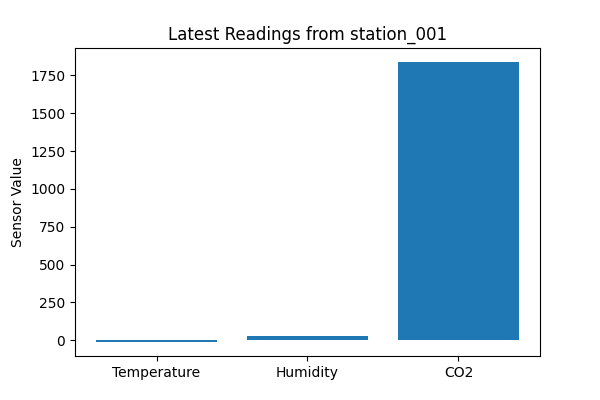
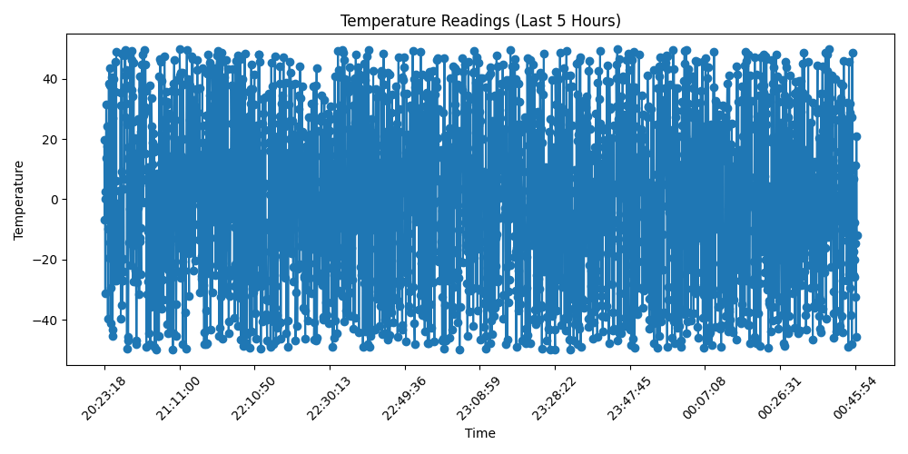
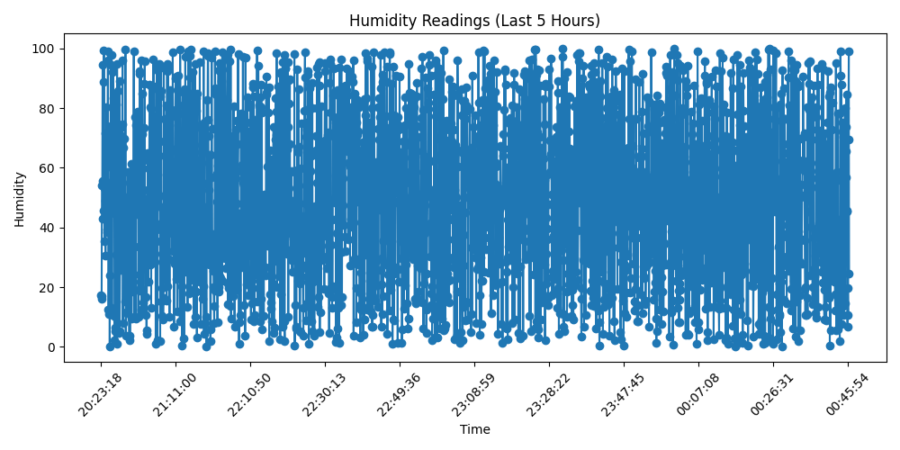
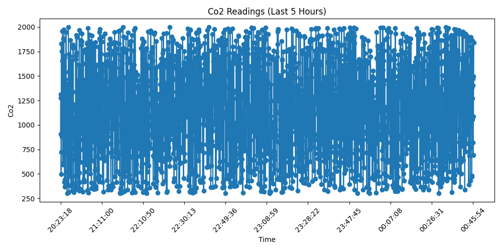

# 🌬️ AirAware: Cloud-Based IoT Environmental Monitoring System

A full-stack IoT system that simulates virtual environmental sensors (temperature, humidity, and CO₂), publishes the data to AWS IoT Core via MQTT, and stores it in MongoDB on an EC2 instance. A companion script generates real-time visualizations and charts for querying the data.

---

## 🚀 Features

- 🛰️ Simulated environmental IoT station
- 🔐 Secure MQTT publishing to AWS IoT Core
- 💾 Data storage using MongoDB on EC2
- 📊 Chart-based visualization for:
  - Latest sensor values (bar chart)
  - 5-hour history of any sensor (line chart)
- 🎛️ CLI-based querying (`latest`, `history`)
- 📁 Output folder includes all generated charts & screenshots

---

## 🧱 Technologies Used

- **Python 3**
- **AWS IoT Core**
- **MQTT Protocol**
- **MongoDB (local on EC2)**
- **Matplotlib**
- **Pymongo**
- **AWSIoTPythonSDK**
- **Amazon EC2 (Amazon Linux 2023)**

---

## 🗂️ Project Structure

```bash
.
├── station_publisher.py         # Sensor simulator + publisher + MongoDB insert
├── visualizer.py                # CLI tool for querying + generating charts
├── .gitignore                   # Excludes certs, logs, output, etc.
├── README.md                    # This file
└── output/                      # Saved charts and screenshots
    ├── latest_readings.png
    ├── temperature_history.png
    ├── humidity_history.png
    ├── co2_history.png
    ├── screenshot_mqtt_publish.png
    ├── screenshot_visualizer_latest.png
    └── screenshot_visualizer_history.png
```

---

## 🧪 How to Run

### 1️⃣ Start the Sensor Publisher (on EC2)

This script generates random data and publishes to AWS + MongoDB.

```bash
python3 station_publisher.py
```

**Expected Output:**

```bash
Connecting to AWS IoT...
Connected!
Stored in MongoDB and Published via MQTT: {'station_id': 'station_001', ...}
```

---

### 2️⃣ Run the Visualizer

Use this to query latest or historical sensor values and generate charts.

```bash
python3 visualizer.py
```

**Commands:**

```bash
latest station_001       # Show latest sensor values (bar chart)
history temperature       # Line chart of temperature over last 5 hours
history humidity
history co2
exit                      # Exit the CLI
```

---

## 🖼️ Sample Charts

### ✅ Latest Sensor Values


### 🌡️ Temperature History


### 💧 Humidity History


### 🏭 CO₂ History


---

## 🔐 Security Notes

All `.pem`, `.key`, and `.crt` files used for AWS IoT authentication are **excluded** using `.gitignore` to ensure safe code sharing.

```gitignore
*.pem
*.crt
*.key
```

---

## 📎 GitHub Repository

[https://github.com/bchikara/AirAware](https://github.com/bchikara/AirAware)

---

## 🙋‍♂️ Author

**Bhupesh Chikara**  
MSCS @ Syracuse University  
GitHub: [@bchikara](https://github.com/bchikara)

---

## 📄 License

This project was developed as part of CIS600 – Internet of Things, Spring 2025.